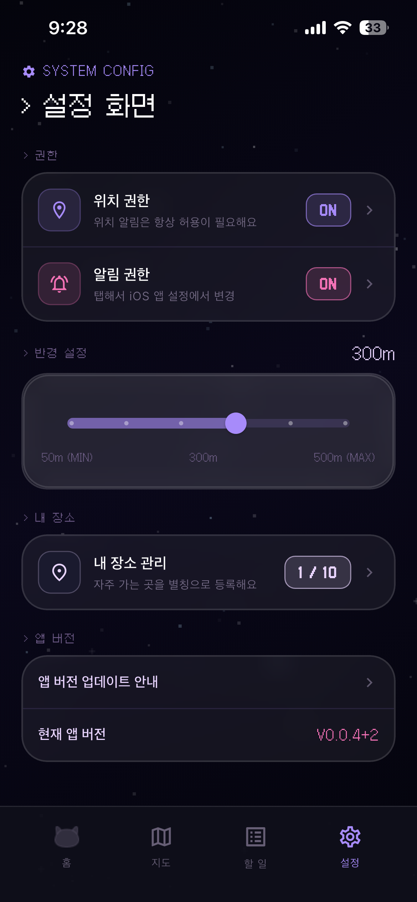
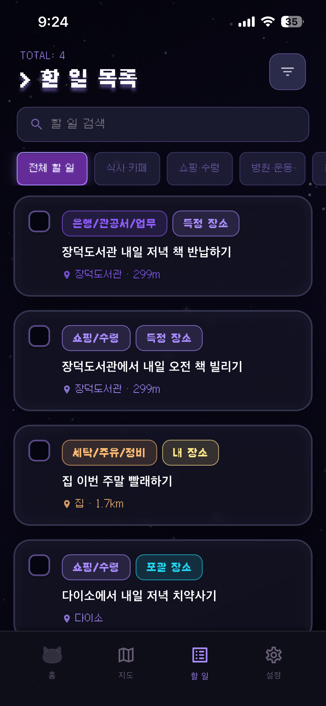
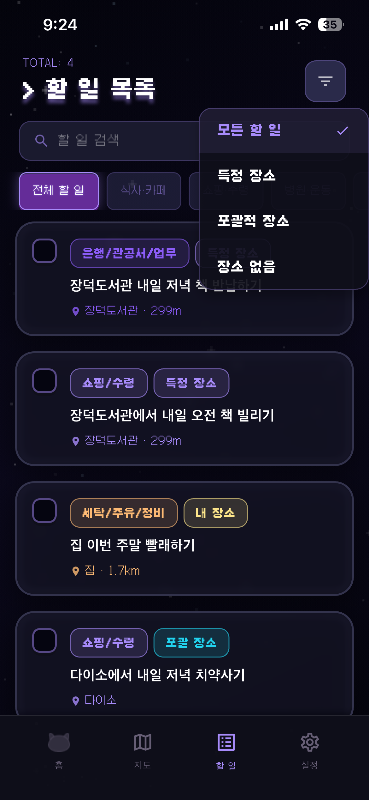
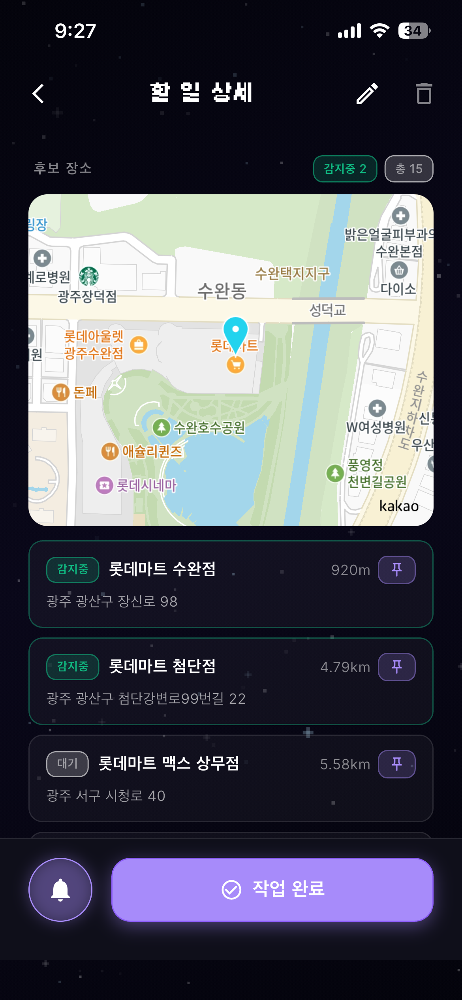
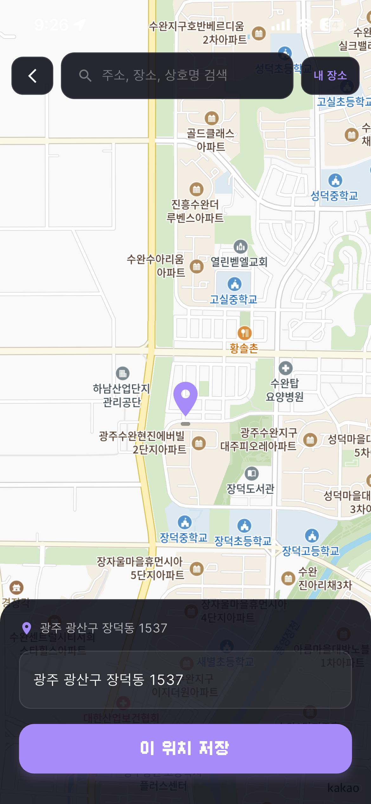
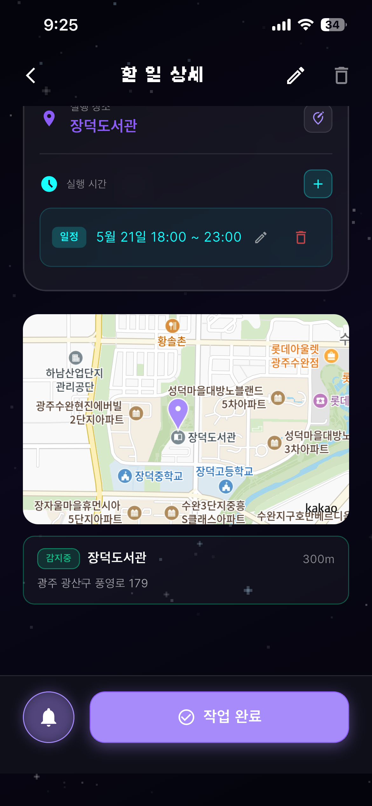
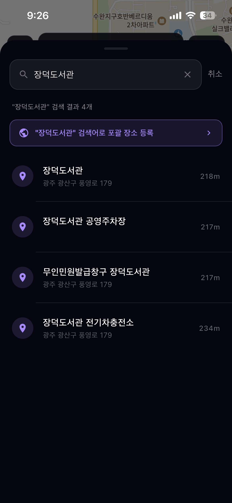
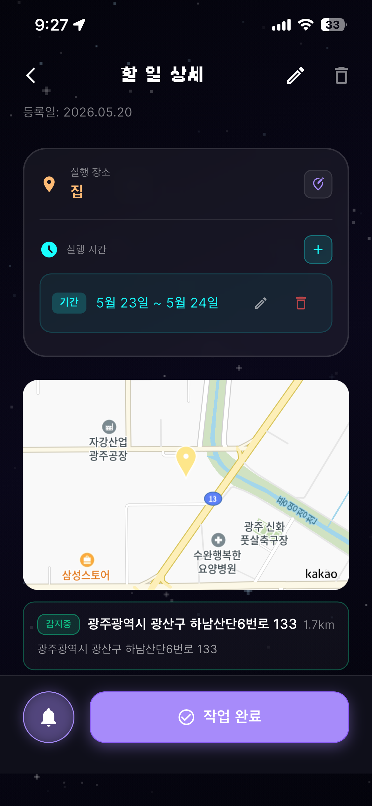
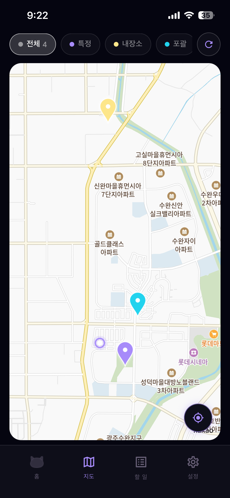
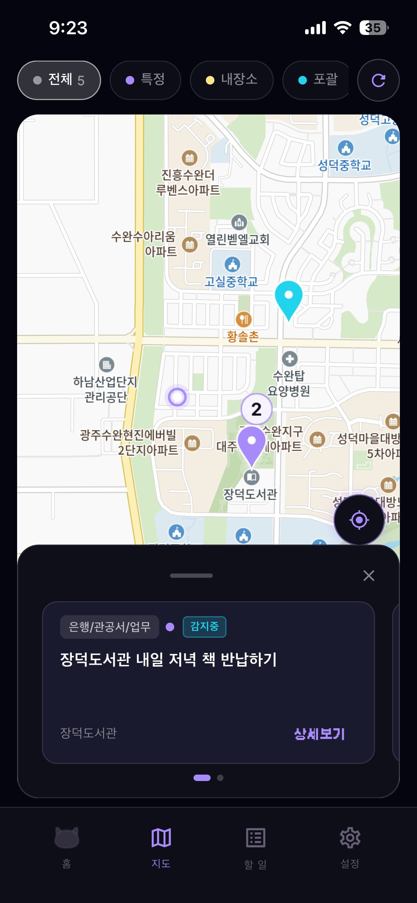

# TimingNote 서비스 시연 시나리오

## 1. 문서 목적

이 문서는 GitLab `exec` 산출물로 제출할 TimingNote 서비스 시연 가이드이다.
시연자가 실제 앱을 조작하면서 어떤 화면을 보여주고, 어디를 클릭하고, 어떤 기능을 설명할지 순서대로 정리한다.

이번 시연은 단순 CRUD보다 아래 흐름을 보여주는 데 초점을 둔다.

- 홈에서 자연어로 할 일을 입력한다.
- AI 구조화 결과를 할 일 목록/상세에서 확인한다.
- 장소 타입이 `포괄 장소`, `특정 장소`, `내 장소`일 때 각각 어떻게 보정되는지 보여준다.
- 지도/검색/내 장소 등록이 위치 기반 추천과 감지 상태로 연결되는 것을 설명한다.

## 2. 시연 시작 상태

시연은 미리 아래 데이터가 등록된 상태에서 시작하는 것이 좋다.
시연 중 모든 데이터를 새로 만들면 검색/API/지도 로딩 지연 때문에 핵심 흐름이 흐려질 수 있다.

| 구분 | 예시 데이터 | 의도 |
| --- | --- | --- |
| 특정 장소 할 일 | `장덕도서관에서 내일 오전 책 빌리기` | 특정 지점 1곳에서만 수행 가능한 할 일 |
| 포괄 장소 할 일 | `다이소에서 내일 저녁 치약사기` | 여러 후보 지점 중 가까운 곳에서 수행 가능한 할 일 |
| 내 장소 할 일 | `집 이번 주말 빨래하기` | 사용자가 등록한 별칭 장소와 연결되는 할 일 |

권장 준비 상태는 다음과 같다.

- 위치 권한: ON
- 알림 권한: ON
- 알림 반경: 300m
- 내 장소: `집` 1개 이상 등록
- 할 일 목록: 포괄/특정/내 장소 유형이 모두 보이도록 3개 이상 등록

## 3. 전체 시연 순서

| 순서 | 화면 | 실행 | 핵심 설명 |
| --- | --- | --- | --- |
| 1 | 홈 | 앱 첫 화면 확인 | 현재 위치 기반 추천과 입력 진입점 확인 |
| 2 | 설정 | 하단 `설정` 탭 클릭 | 위치/알림 권한과 반경 설정 확인 |
| 3 | 홈 | 하단 입력창에 할 일 입력 | 자연어 입력과 시간/장소 보조 칩 설명 |
| 4 | 할 일 목록 | 하단 `할 일` 탭 클릭 | 포괄/특정/내 장소가 같이 등록된 상태 확인 |
| 5 | 할 일 상세 | 목록 카드 클릭 | 장소 타입과 `감지중` 상태 확인 |
| 6-1 | 포괄 장소 분기 | 후보 장소 중 하나를 특정 장소로 지정 | 포괄 후보를 특정 지점으로 좁히는 보정 |
| 6-2 | 포괄 장소 분기 | 지도 탭에서 검색 후 장소 등록 | 지도 기반 검색/위치 저장으로 후보 보정 |
| 7 | 특정 장소 분기 | 지도/검색에서 포괄 장소 등록 | 특정 지점을 다시 포괄 장소로 변경 |
| 8 | 할 일 목록 | 검색 수행 | 제목/장소 기반 검색 결과 확인 |
| 9 | 설정 > 내 장소 | 내 장소 등록 | 별칭 장소 등록과 재사용성 설명 |
| 10 | 홈 | 내 장소를 포함한 할 일 입력 | `집` 같은 별칭이 할 일 장소로 연결됨을 확인 |
| 11 | 상세/지도 | 내 장소 상세와 지도 탭 확인 | 최종적으로 지도 마커와 감지 대상 확인 |

## 4. 상세 시연 시나리오

### 4.1 홈에서 현재 위치 기반 추천 확인

**홈 시작 상태**
- 

| 항목 | 내용 |
| --- | --- |
| 진입 | 앱 실행 직후 홈 화면 |
| 클릭 위치 | 별도 클릭 없이 현재 화면 확인 |
| 확인 요소 | `지금 할 수 있어요!`, 현재 행정동, 추천 카드, 알림함, 새로고침, 하단 입력창 |
| 시연 멘트 | "홈 화면은 현재 위치에서 처리 가능한 할 일을 바로 보여줍니다. 미리 등록된 포괄/특정/내 장소 할 일이 현재 위치와 가까우면 추천 카드로 올라옵니다." |

**이 화면에서 가능한 기능**

- 우측 새로고침: 현재 위치 기준 추천 목록 다시 계산
- 알림 아이콘: 위치 알림 이력 확인
- 추천 카드 `완료`: 해당 할 일을 즉시 완료 처리
- 하단 입력창: 자연어 할 일 입력
- 하단 탭: 홈, 지도, 할 일, 설정 이동

### 4.2 설정에서 권한과 반경 확인

**설정 권한 확인**
- 

| 항목 | 내용 |
| --- | --- |
| 진입 | 하단 네비게이션 `설정` 탭 클릭 |
| 클릭 위치 | 하단 오른쪽 톱니바퀴 아이콘 |
| 확인 요소 | 위치 권한 ON, 알림 권한 ON, 반경 300m, 내 장소 관리 |
| 시연 멘트 | "위치 기반 알림은 권한과 반경 설정이 전제입니다. 사용자는 여기서 위치 권한, 알림 권한, 감지 반경, 내 장소를 관리합니다." |

**이 화면에서 가능한 기능**

- 위치 권한 상태 확인 및 OS 설정 이동
- 알림 권한 상태 확인 및 OS 설정 이동
- 감지 반경 조절: 50m부터 500m까지 조정
- 내 장소 관리 진입
- 앱 버전 확인

### 4.3 홈 입력창에 할 일 입력

**홈 입력창**
- 

| 항목 | 내용 |
| --- | --- |
| 진입 | 하단 `홈` 탭으로 돌아간 뒤 입력창 클릭 |
| 클릭 위치 | 화면 하단 `새로운 할 일을 입력하세요` 영역 |
| 입력 예시 1 | `장덕도서관에서 내일 오전 책 빌리기` |
| 입력 예시 2 | `다이소에서 내일 저녁 치약사기` |
| 입력 예시 3 | `집 이번 주말 빨래하기` |
| 시연 멘트 | "사용자는 정해진 양식 없이 자연어로 입력합니다. 시간 표현이나 내 장소 별칭이 포함되면 구조화 결과에 시간 조건과 장소가 함께 반영됩니다." |

**실행 순서**

1. 하단 입력창을 누른다.
2. 자연어 할 일을 입력한다.
3. 필요하면 화면 위 시간 추천 칩을 누른다.
4. 오른쪽 전송 버튼을 누른다.
5. 구조화가 끝나면 할 일 목록 또는 상세 화면에서 결과를 확인한다.

**설명 포인트**

- AI는 문장에서 할 일 내용, 카테고리, 장소, 시간 조건을 추출한다.
- 백엔드는 장소 타입을 검증하고 후보 장소를 저장한다.
- 사용자는 이후 상세/수정 화면에서 자동 구조화 결과를 보정할 수 있다.

### 4.4 할 일 목록에서 등록 결과 확인

**할 일 목록**
- 
**목록 필터**
- 
| 항목 | 내용 |
| --- | --- |
| 진입 | 하단 `할 일` 탭 클릭 |
| 클릭 위치 | 하단 리스트 아이콘 |
| 확인 요소 | 전체 할 일 수, 검색창, 카테고리 필터, 정렬/장소 필터, 포괄/특정/내 장소 배지 |
| 시연 멘트 | "목록에서는 포괄 장소, 특정 장소, 내 장소가 배지로 구분됩니다. 같은 할 일이라도 장소 타입에 따라 추천과 감지 방식이 달라집니다." |

**이 화면에서 가능한 기능**

- 검색창: 제목/장소 기반 검색
- 카테고리 칩: 식사/카페, 쇼핑/수령 등 업무 성격별 필터
- 우측 상단 필터 버튼: 모든 할 일, 특정 장소, 포괄 장소, 장소 없음 기준 필터
- 체크박스: 할 일 완료 처리
- 카드 터치: 상세 화면 이동

## 5. 장소 타입별 상세 시연

### 5.1 공통: 상세 화면에서 감지 상태 확인

목록 카드 하나를 클릭해 상세 화면으로 들어간다.
상세 화면에서는 다음을 확인한다.

- 상단 배지: 카테고리와 장소 타입
- 상태: 진행 중
- 실행 장소: 특정/포괄/내 장소에 따라 다르게 표시
- 실행 시간: 시간 조건이 있으면 일정/기간/반복으로 표시
- 후보 장소: 지도와 후보 카드
- `감지중`: 현재 geofence 감지 대상으로 등록된 장소 수
- `작업 완료`: 할 일 완료 처리

### 5.2 분기 1: 포괄 장소인 경우

**포괄 장소 후보**
- 

| 항목 | 내용 |
| --- | --- |
| 진입 | 목록에서 `포괄 장소` 배지가 붙은 할 일 클릭 |
| 확인 요소 | `포괄 장소` 배지, 후보 장소 수, `감지중` 수, 후보 장소 목록 |
| 시연 멘트 | "포괄 장소는 특정 지점 하나가 아니라 검색어에 맞는 여러 후보 장소를 대상으로 합니다. 그래서 가까운 후보가 여러 개 있으면 감지 대상도 여러 개가 될 수 있습니다." |

#### 5.2.1 후보 장소 중 하나를 특정 장소로 지정

| 실행 | 클릭 위치 | 결과 |
| --- | --- | --- |
| 후보 장소 확인 | 상세 하단 후보 장소 영역 | 현재 검색어로 매칭된 후보 지점과 거리 확인 |
| 특정 지점 선택 | 후보 카드 또는 후보 카드의 우측 액션 버튼 | 포괄 장소 후보 중 하나를 실행 장소로 확정 |
| 저장 후 상세 확인 | 상세 화면으로 복귀 | 장소 타입이 특정 장소 기준으로 좁혀지고 감지 대상이 해당 지점 중심으로 바뀜 |

**설명 포인트**

- 사용자가 "다이소 아무 곳이나"가 아니라 "이 다이소 지점"으로 확정할 때 사용한다.
- 자동 추천 후보가 맞지 않으면 사용자가 직접 특정 지점으로 보정할 수 있다.

#### 5.2.2 지도 페이지에서 검색 후 장소 등록

**지도 위치 저장**
- 

| 실행 | 클릭 위치 | 결과 |
| --- | --- | --- |
| 지도 탭 이동 | 하단 `지도` 탭 | 지도 화면 진입 |
| 검색창 클릭 | 지도 상단 검색창 | 주소/장소/상호명 검색 가능 |
| 지도 핀 조정 | 지도 위 원하는 위치 | 선택 좌표가 바뀜 |
| `이 위치 저장` 클릭 | 하단 큰 보라색 버튼 | 선택한 위치를 장소로 등록 |

**설명 포인트**

- 검색 결과가 애매하거나 실제 장소 위치를 직접 지정해야 할 때 사용한다.
- 지도에서 저장한 좌표는 이후 후보 장소/내 장소/감지 대상에 재사용된다.

### 5.3 분기 2: 특정 장소인 경우

**특정 장소 상세**
- 

| 항목 | 내용 |
| --- | --- |
| 진입 | 목록에서 `특정 장소` 배지가 붙은 할 일 클릭 |
| 확인 요소 | 특정 장소 배지, 실행 장소, 시간 조건, 지도, `감지중` 표시 |
| 시연 멘트 | "특정 장소는 이 지점 하나를 기준으로 감지합니다. 예를 들어 장덕도서관처럼 정확한 장소가 정해진 할 일은 특정 장소로 저장됩니다." |

#### 5.3.1 특정 장소를 포괄 장소로 변경

**포괄 장소 등록 검색**
- 
**할 일 수정**
- 
| 실행 | 클릭 위치 | 결과 |
| --- | --- | --- |
| 수정 진입 | 상세 우측 상단 연필 아이콘 | 할 일 수정 화면 이동 |
| 장소 행 클릭 | 수정 화면의 장소 영역 | 장소 검색 화면 이동 |
| 검색어 입력 | 검색창에 `장덕도서관` 등 입력 | 검색 결과와 포괄 등록 버튼 표시 |
| 포괄 등록 | `"검색어" 검색어로 포괄 장소 등록` 버튼 | 특정 지점이 아니라 검색어 기반 포괄 장소로 변경 |
| 저장 | 수정 화면 우측 상단 `완료` | 변경 사항 반영 |

**설명 포인트**

- 특정 장소가 너무 좁게 잡혔을 때 포괄 장소로 되돌릴 수 있다.
- 예를 들어 "도서관 아무 곳이나"가 목적이라면 특정 지점보다 포괄 장소가 더 적합하다.

## 6. 목록에서 검색 수행

**목록 검색**
- 

| 항목 | 내용 |
| --- | --- |
| 진입 | 하단 `할 일` 탭 |
| 클릭 위치 | 상단 검색창 |
| 검색어 예시 | `장`, `내일`, `주말`, `집`, `다이소` |
| 시연 멘트 | "등록된 할 일은 제목과 장소 기준으로 검색할 수 있습니다. 목록 검색은 전체 할 일 중 지금 확인하고 싶은 작업을 빠르게 찾기 위한 기능입니다." |

**이 화면에서 가능한 기능**

- 제목 검색
- 장소명 검색
- 카테고리 필터와 검색어 조합
- 완료/진행 중 상태 구분
- 검색 결과 카드에서 상세 이동

## 7. 설정에서 내 장소 등록

**내 장소 목록**
- 
**지도 위치 저장**
- 

| 항목 | 내용 |
| --- | --- |
| 진입 | 설정 화면의 `내 장소 관리` 클릭 |
| 클릭 위치 | 설정 화면 중간 `내 장소 관리` 카드 |
| 확인 요소 | 등록 개수, 별칭, 주소, 수정/삭제, 우측 상단 `+` 버튼 |
| 시연 멘트 | "내 장소는 사용자가 자주 가는 장소를 별칭으로 저장하는 기능입니다. 집, 회사처럼 반복적으로 쓰는 장소를 등록하면 이후 자연어 입력에서 재사용할 수 있습니다." |

**등록 실행 순서**

1. `내 장소` 화면 우측 상단 `+` 버튼을 누른다.
2. 지도 화면에서 주소/장소/상호명을 검색한다.
3. 지도 핀 또는 검색 결과로 위치를 정한다.
4. 하단 `이 위치 저장`을 누른다.
5. 별칭을 입력한다. 예: `집`, `회사`, `학교`
6. 저장 후 내 장소 목록에 추가된 것을 확인한다.

**이 화면에서 가능한 기능**

- 내 장소 추가
- 별칭 수정
- 내 장소 삭제
- 등록 가능한 장소 수 확인
- 등록된 주소 확인

## 8. 홈에서 내 장소 기반 할 일 등록

**홈 입력창**
- 
**내 장소 할 일 상세**
- 

| 항목 | 내용 |
| --- | --- |
| 진입 | 하단 `홈` 탭 |
| 입력 예시 | `집 이번 주말 빨래하기` |
| 기대 결과 | 상세 화면에서 `내 장소` 배지와 실행 장소 `집` 확인 |
| 시연 멘트 | "사용자가 등록한 내 장소는 자연어 입력에서 바로 사용할 수 있습니다. `집 이번 주말 빨래하기`처럼 입력하면 별칭 `집`이 실행 장소로 연결됩니다." |

**확인 포인트**

- 상세 화면의 장소 타입이 `내 장소`인지 확인한다.
- 실행 장소가 `집`으로 표시되는지 확인한다.
- 시간 조건이 함께 추출되면 실행 시간 영역에 표시되는지 확인한다.
- 내 장소도 지도/감지 대상과 연결된다는 점을 설명한다.

## 9. 지도 탭에서 전체 장소 확인

**지도 전체 화면**
- 
**지도 마커 상세**
- 

| 항목 | 내용 |
| --- | --- |
| 진입 | 하단 `지도` 탭 클릭 |
| 확인 요소 | 전체/특정/내장소/포괄 필터, 현재 위치 버튼, 지도 마커 |
| 시연 멘트 | "지도 탭에서는 할 일 장소를 공간적으로 확인할 수 있습니다. 특정 장소, 내 장소, 포괄 장소를 필터링하고 마커를 눌러 연결된 할 일을 볼 수 있습니다." |

**이 화면에서 가능한 기능**

- `전체`: 모든 장소 마커 표시
- `특정`: 특정 장소 할 일만 표시
- `내장소`: 집/회사 같은 별칭 장소 표시
- `포괄`: 포괄 장소 후보 표시
- 새로고침: 현재 위치와 장소 목록 갱신
- 현재 위치 버튼: 지도 중심을 현재 위치로 이동
- 마커 클릭: 해당 장소와 연결된 할 일 카드 확인

